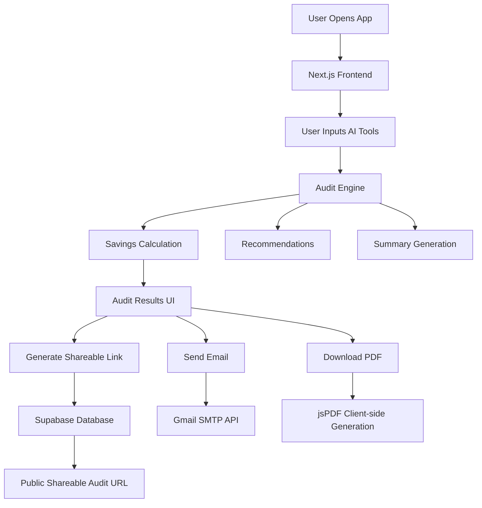

# ARCHITECTURE.md

# AI Spend Audit — Architecture

## System Overview

---

# Data Flow

1. A user lands on the homepage and inputs their AI subscriptions, monthly costs, team size, and use case.

2. The frontend stores form state locally using browser localStorage so data persists across reloads.

3. When the user clicks “Run Audit”, the audit engine evaluates:

   * whether the plan is oversized
   * whether cheaper alternatives exist
   * whether the stack is already optimized

4. The engine calculates:

   * monthly savings
   * annual savings
   * optimization recommendations
   * reasoning for each recommendation

5. Results are displayed immediately without requiring signup.

6. If the user chooses:

   * audit results are stored in Supabase
   * a unique public URL is generated
   * email reports can be sent using Gmail SMTP
   * PDF reports are generated client-side using jsPDF

7. Public audit URLs intentionally exclude personal details like email or company name.

---

# Stack Choice

## Frontend

* Next.js 15
* React
* TypeScript
* Tailwind CSS

I chose Next.js because:

* fast deployment on Vercel
* excellent routing for shareable audit pages
* built-in API routes
* production-ready React architecture

TypeScript was used for safer audit calculations and cleaner maintainability.

Tailwind CSS allowed rapid UI iteration while keeping bundle size small.

---

# Backend

## Supabase

Used for:

* audit storage
* shareable report retrieval
* lead storage

I chose Supabase because:

* fast setup
* PostgreSQL support
* generous free tier
* simple integration with Next.js

---

# Email Infrastructure

## Gmail SMTP + Nodemailer

Used for:

* transactional audit emails
* free delivery during MVP stage

I initially experimented with Resend, but switched to Gmail SMTP because Resend requires verified domains for production delivery.

---

# PDF Generation

## jsPDF

PDF generation happens client-side to avoid serverless Chromium issues on Vercel free tier.

I initially explored Puppeteer, but browser-based PDF generation was:

* simpler
* faster
* cheaper
* more reliable on free hosting

---

# Audit Engine Design

The audit engine intentionally uses deterministic rule-based logic instead of AI.

Reason:

* pricing math should be predictable
* recommendations should be explainable
* finance-oriented decisions require consistency

AI is used only for generating human-readable summaries.

---

# Scalability Considerations (10k audits/day)

If this system needed to support 10k+ audits/day, I would:

1. Move audit processing into background jobs
2. Add Redis caching for pricing data
3. Replace Gmail SMTP with SES or Postmark
4. Add rate limiting and abuse protection
5. Store pricing configurations in a database instead of hardcoded objects
6. Add analytics and monitoring
7. Generate PDFs asynchronously
8. Add CDN caching for public audit pages

---

# Security & Privacy

* No authentication required for basic usage
* Public reports exclude sensitive information
* Secrets stored in environment variables
* No API keys exposed client-side

---

# Future Improvements

If I continued building this product, I would add:

* benchmark comparisons
* API spend estimators
* Open Graph previews
* embedded widgets
* referral systems
* Stripe integration
* AI spend trend tracking
* admin analytics dashboard
