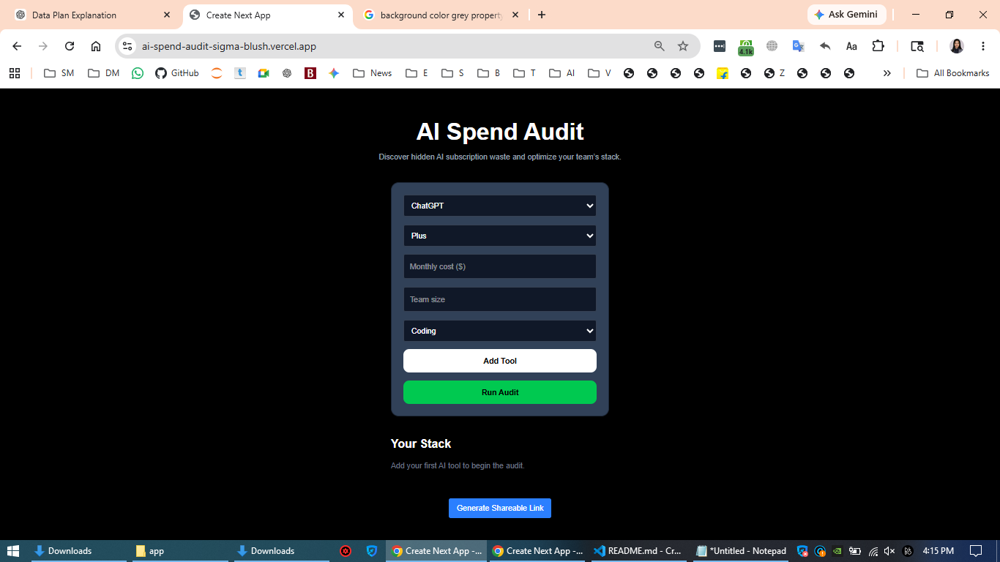
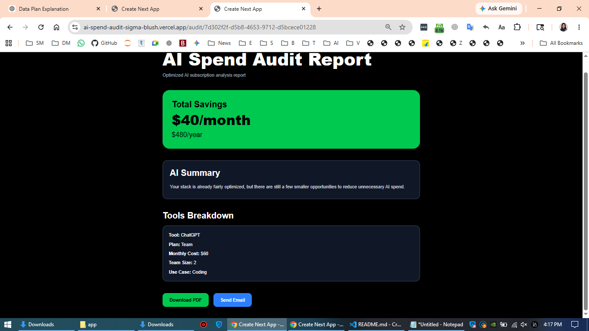

# AI Spend Audit

AI Spend Audit is a free web application that helps startups analyze and optimize their AI subscription spending. Users can instantly audit tools like ChatGPT, Cursor, Claude, Copilot, and Gemini to identify overspending opportunities, generate shareable reports, download PDFs, and receive audit summaries by email.

Built as part of the Credex Web Development Internship Assignment.

---

# Live Demo

Deployed URL:

https://ai-spend-audit-sigma-blush.vercel.app

---

# Screenshots

## Homepage


## Audit Results


## Shareable Report Page


---

# Features

## Core MVP Features

* AI spend input form
* Instant audit engine
* Monthly + annual savings calculation
* Personalized optimization summaries
* Shareable public audit URLs
* PDF report generation
* Email report delivery
* LocalStorage persistence
* Responsive mobile UI

---

# Supported Tools

* ChatGPT
* Cursor
* Claude
* GitHub Copilot
* Gemini
* Windsurf

---

# Tech Stack

## Frontend

* Next.js 15
* React
* TypeScript
* Tailwind CSS

## Backend

* Supabase

## Email

* Nodemailer + Gmail SMTP

## Deployment

* Vercel

## PDF Generation

* jsPDF

---

# Quick Start

## 1. Clone Repository

```bash id="ywytxn"
git clone https://github.com/Nilamvsp/ai-spend-audit.git
```

---

## 2. Install Dependencies

```bash id="hq95x3"
npm install
```

---

## 3. Add Environment Variables

Create:

```txt id="7j5syh"
.env.local
```

Add:

```env id="w7mjlwm"
NEXT_PUBLIC_SUPABASE_URL=your_url
NEXT_PUBLIC_SUPABASE_ANON_KEY=your_key

EMAIL_USER=your_email@gmail.com
EMAIL_PASS=your_gmail_app_password
```

---

## 4. Run Development Server

```bash id="jlwmg6"
npm run dev
```

---

## 5. Run Tests

```bash id="vjlwmk"
npm run test
```

---

# Deployment

This project is deployed using Vercel.

Production deployment:

* automatic builds from GitHub
* environment variables configured in Vercel dashboard

---

# Architecture Overview

The application follows a simple full-stack architecture:

1. User submits AI stack data
2. Audit engine evaluates overspending
3. Recommendations and savings are generated
4. Reports are stored in Supabase
5. Public shareable links are created
6. PDFs and emails are generated on demand

Detailed architecture documentation is available in:

```txt id="djlwmz"
ARCHITECTURE.md
```

---

# Audit Logic

The audit engine intentionally uses deterministic business rules rather than AI-generated calculations.

Examples:

* Team plans for solo users are flagged as oversized
* Lower-tier plans are recommended where functionality overlap exists
* Already optimized stacks produce honest zero-savings results

AI is only used for generating human-readable summaries.

---

# Decisions & Tradeoffs

## 1. Deterministic audit logic instead of AI calculations

Reason:
financial recommendations should be consistent and explainable.

---

## 2. Gmail SMTP instead of Resend

Reason:
free deployment compatibility and easier testing during MVP stage.

---

## 3. Client-side PDF generation instead of Puppeteer

Reason:
Puppeteer caused deployment complexity on Vercel free tier.

---

## 4. No authentication

Reason:
reduces friction and improves conversion for cold visitors.

---

## 5. Supabase instead of custom backend

Reason:
faster MVP iteration and generous free tier.

---

# Tests

The project includes automated audit engine tests covering:

* savings calculations
* downgrade recommendations
* annual savings logic
* optimized plan detection

See:

```txt id="bjlwmv"
TESTS.md
```

---

# Accessibility & Performance

The UI was designed with:

* responsive layouts
* keyboard-accessible forms
* readable contrast
* mobile-first structure

---

# Future Improvements

* benchmark analytics
* Open Graph previews
* usage trend tracking
* referral system
* embedded widgets
* admin dashboard
* Stripe integration
* AI usage forecasting

---

# Author

Nilam Sutar

GitHub:
https://github.com/Nilamvsp


[def]: image.png